# README

# EstiTasker
生成AIによる自動タスク作成、自動作業時間見積り機能、アドバイス機能付きのタスク管理ツールです  
タスク管理、タスクの一括作成、タスクの細分化、自動で作業時間見積りなどができます。 

# URL
https://esti-tasker.vercel.app/sign_in
ゲストログインボタンから、メールアドレスパスワードなしで機能をお試しいただけます。

# 使用技術
### バックエンド
- Ruby
- Ruby on Rails
- devise
- devise_token_auth
- rack-cors
- PostgreSQL
- Rspec

### フロントエンド
- Next.js
- zustand
- Typescript
- Material-UI
- dnd-kit
- day-js
- axios
- nookies
- tailwindcss
- chartjs 2

### 開発・デプロイツール,　その他
- AWS
  - AWS SDK
  - AWS Bedrock
- Claude v3 Haiku
- Docker/Docker-compose
- Github Actions
- Heroku
- Vercel

# Github Actions
- Githubへのpush時に、Rspecが自動で実行されます。
- masterへのpushで、Herokuに自動デプロイが実行されます。

# 設計
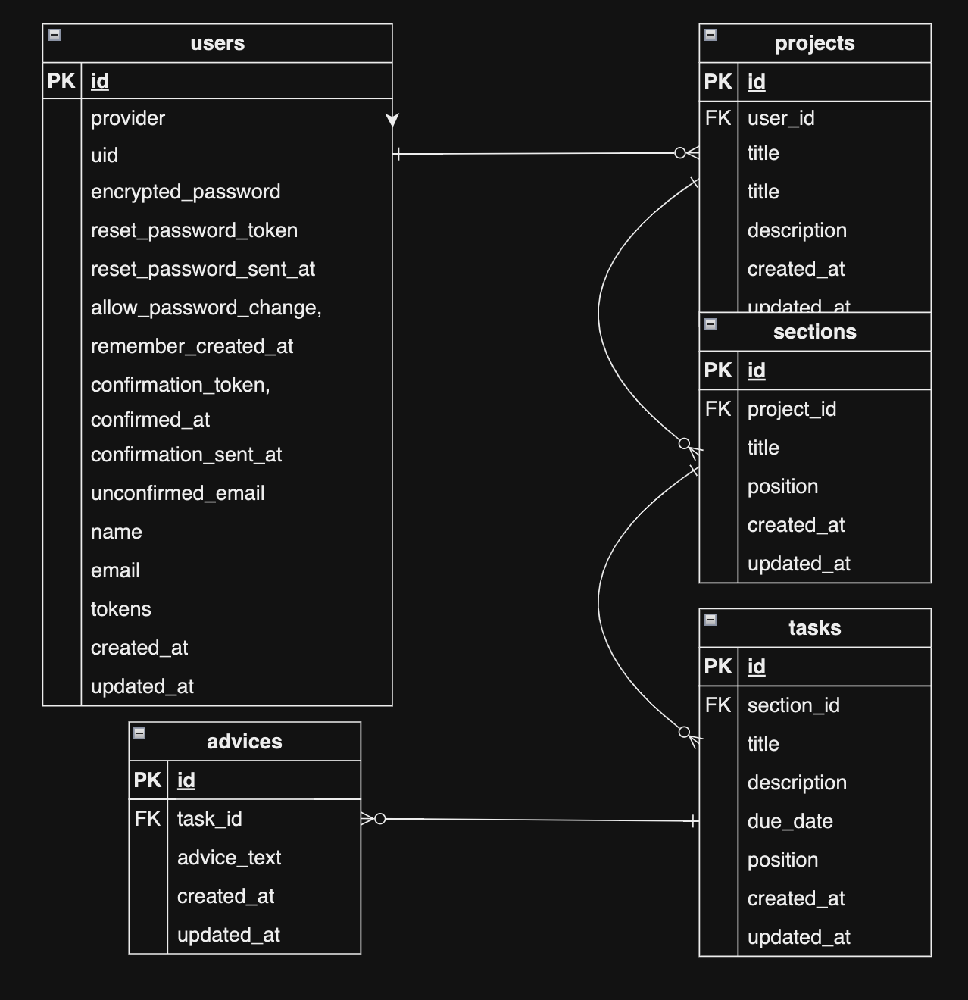

# 機能紹介

## ログインページ
- devise_token_auth を使用したログイン機能です。ゲストログイン、メールアドレスログインを実装。ログイン後、Rails 側にユーザ情報を渡します。
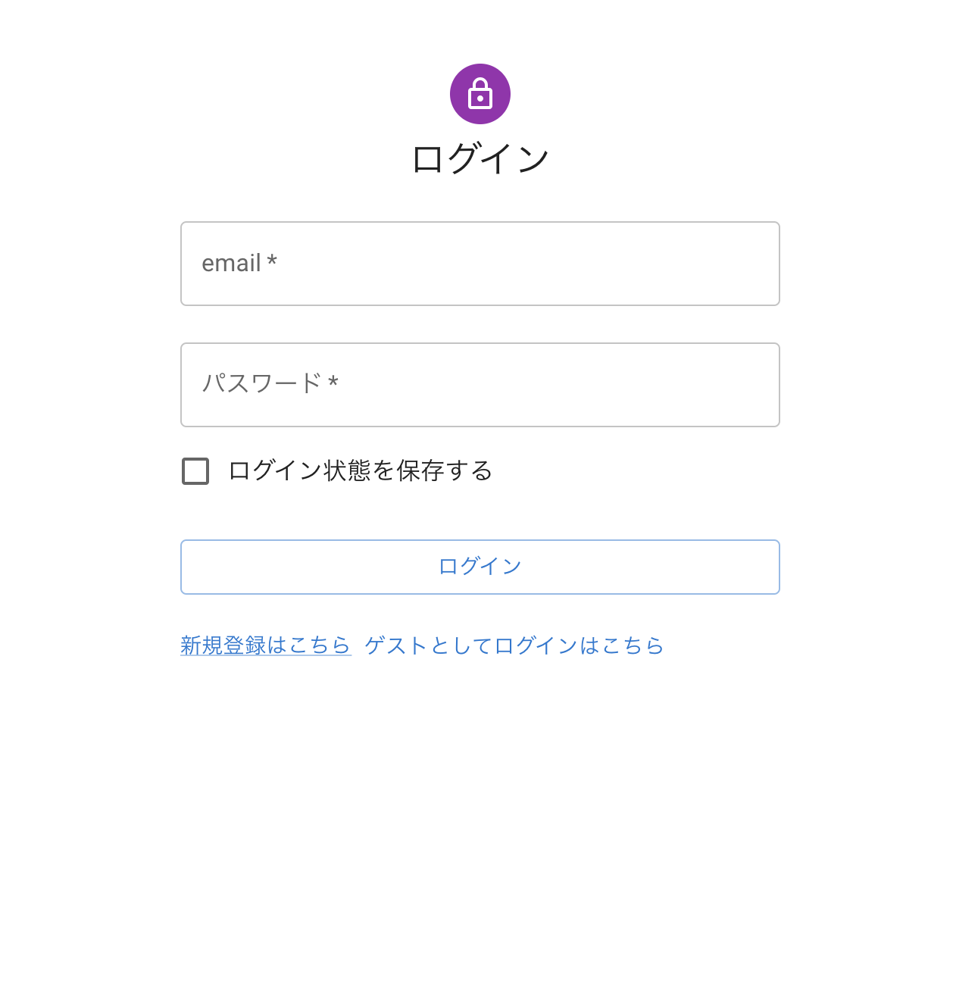

## Project　一覧ページ
- Project一覧を表示します。
- タイトルと説明を入力して、新しいプロジェクトを登録することもできます。
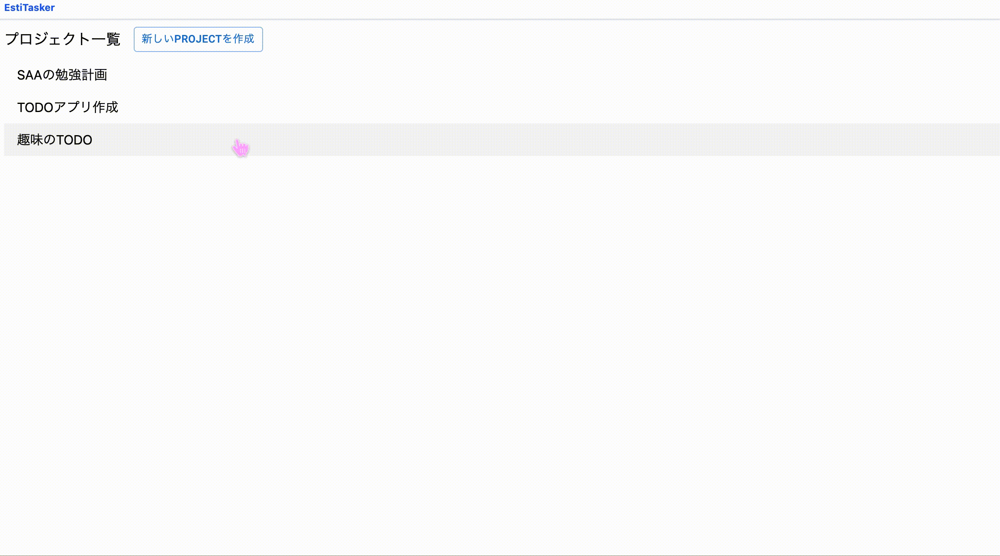

## タスク一覧ページ
### セクション　タスクの追加、削除
- セクションを追加でき、タイトルの編集ができます。
- タスクを追加を押すと、タスクの新規作成ができます。
- タスクのタイトルの登録ができます。
- タスクの削除ができます。
- セクションの削除ができます。

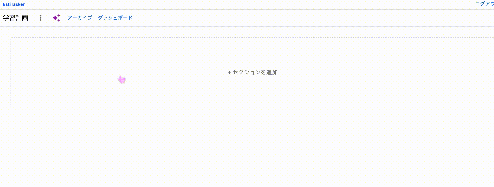

### 並び替え
- セクションの並び替えができます。
- タスクの並び替えができます。
- セクションを跨いだ並び替えも可能です。
- ドラッグ＆ドロップで並び替えが可能です。(dnd-kit使用)

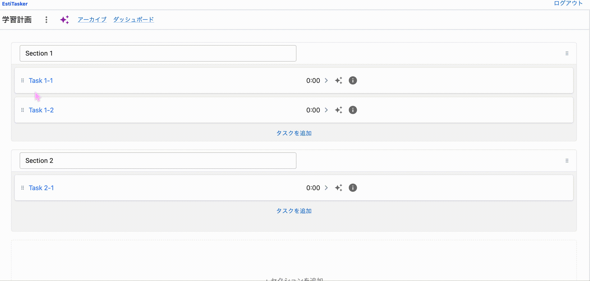

### タスクとタスク時間見積りの自動作成
- タスクのタイトルとタスクの説明を入力して、タスクを自動作成することができます。Claude v3 Haikuを使用しています。
- その際に、タスクにかかる時間を自動見積りします。

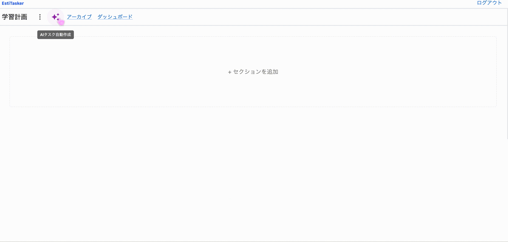

### タスクの細分化
- AIにより、タスクを細分化することができます。

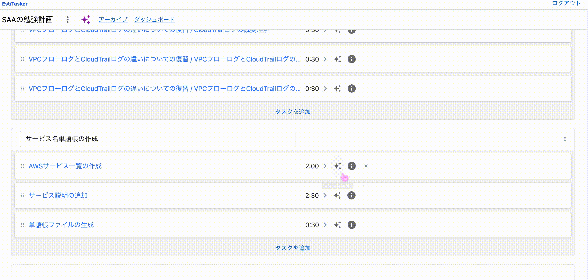

### アドバイスの自動作成
- タスクに関するアドバイスを確認することができます。
- タスクに関するアドバイスを生成することができます。タスク達成に役立つ最適なアドバイスを数種類生成します。
- Claude v3 Haikuを使用しています。

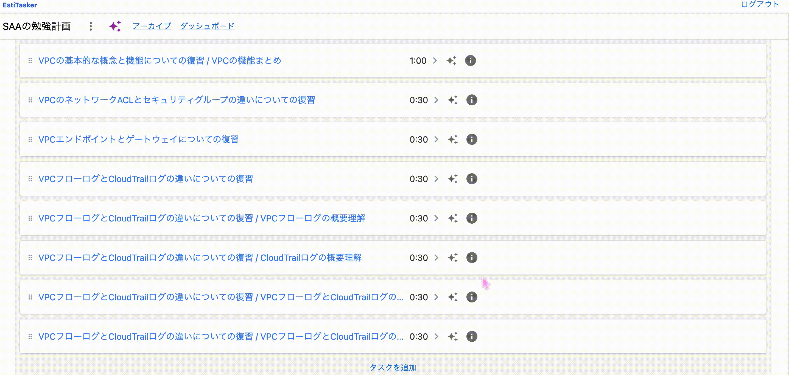

### タスクの詳細設定
- タスクの詳細を編集することができます。
- タイトル、memo、期日、作業時間を設定できます。
- 完了したタスクをアーカイブに追加できます。

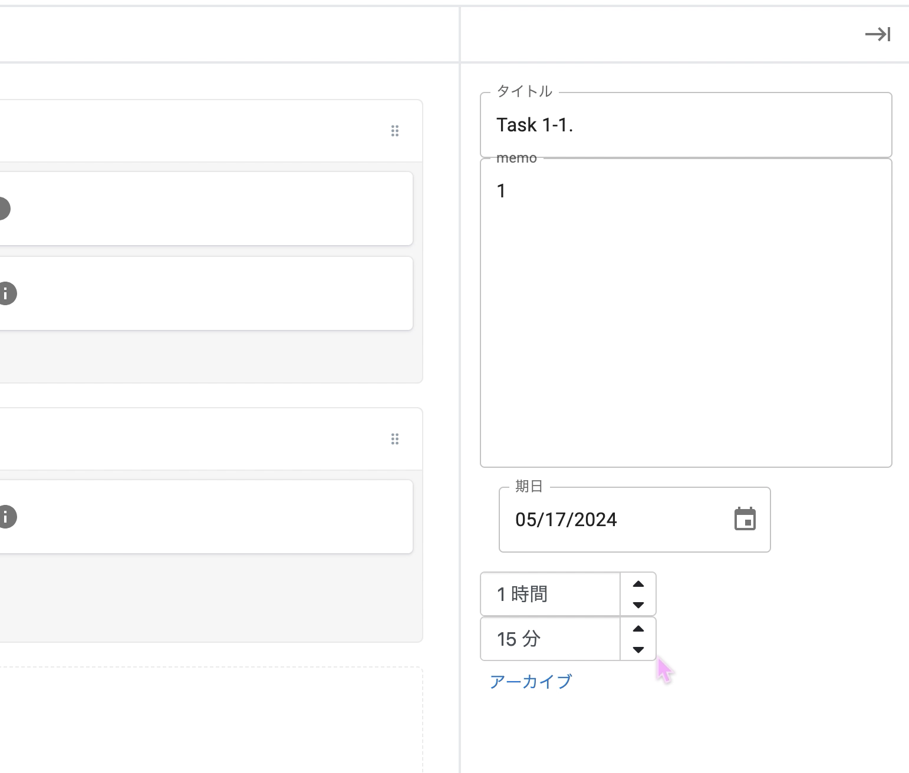

## アーカイブページ
- アーカイブされたタスクを確認することができます。
- アーカイブからタスク一覧へ戻すことができます。
- タスクを削除できます。
- 全てのアーカイブを一括で削除できます。

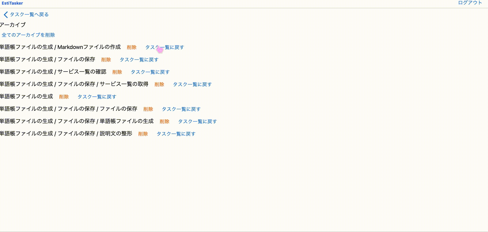

## ダッシュボード
- ダッシュボードを見ることができます。

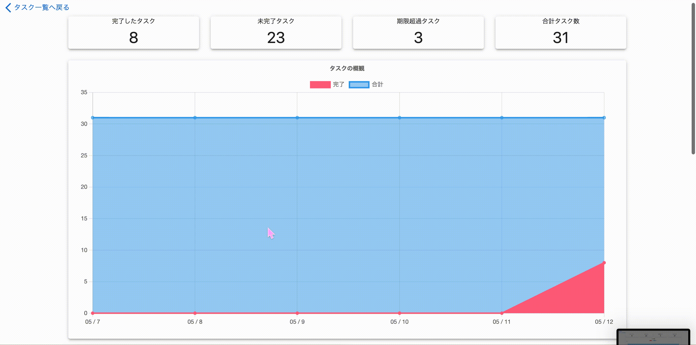

# 機能一覧
- ユーザ登録、ログイン機能(devise, devise_token_auth)
- プロジェクト機能
  - プロジェクト名、プロジェクトの説明を登録、編集、削除
  - プロジェクト一覧
- セクション機能
  - セクションを追加、編集、削除
  - セクションの並べ替え(dnd-kit)
- タスク機能
  - タスク作成、編集、削除
  - タスクタイトル、memo、期日を設定
  - タスク見積時間を設定、編集
  - タスクの並べ替え(dnd-kit)
- アーカイブ機能
  - タスクをアーカイブ
  - 一括削除
- ダッシュボード機能
  - タスクの完了、未完了をダッシュボードで確認
  - タスクの完了、未完了をグラフで確認
- AIによる自動作成機能(AWS Bedrock, Claude v3 Haiku)
  - タスクのタイトルと説明を入力すると、AIがタスクと作業時間見積りを自動作成
  - 既存のタスクを更に細分化して自動作成
- AIによるタスクについてのアドバイス機能(AWS Bedrock, Claude v3 Haiku)
  - タスクについての効果的なアドバイスを生成
  - アドバイスの一覧表示

## 開発にあたって
タスク管理が苦手な友人からインスピレーションを受け、タスク管理をサポートする機能をつけたタスク管理アプリを開発いたしました。

- タスク自体をAIを使い自動作成することによって、タスクの工程の洗い出し、タスク入力の手間を省くことができます。これにより、タスク管理が苦手な方でも負担が少なくタスク管理アプリを使用することができます。
- タスクの作業見積もり時間を生成することにより、タスクにかかる時間を想定することが苦手な人の補助になります。
- タスクを効率的、効果的に達成するためのアドバイスを生成することにより、タスクを効率よくこなすことを苦手とする方の生産性を上げることができます。

## 今後の課題

個人の生活スタイルを把握して、それに沿って自動的にカレンダー形式でタスクをスケジュールする機能を実装する予定でしたが、時間の都合上つけていません。
UIやUXの学習をして、ユーザが使用しやすいデザインのアプリを開発したいです。
